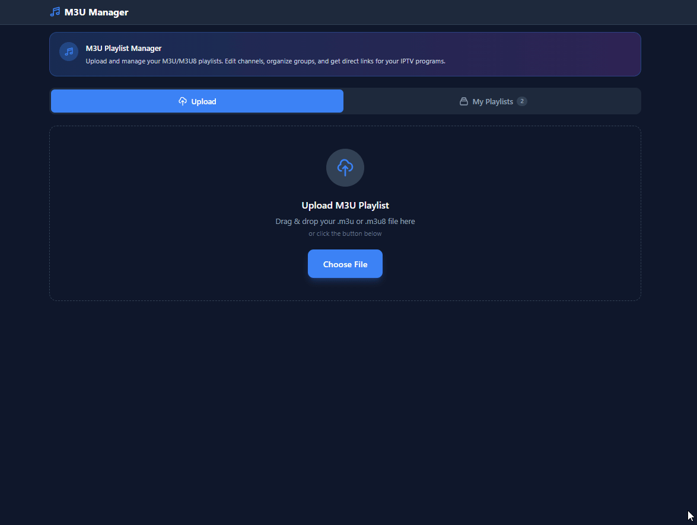

# M3U Manager

A modern web application for managing M3U/M3U8 IPTV playlists. Upload, edit, organize, and export your playlists with an intuitive dark-themed interface.



## Features

- **Playlist Upload** - Drag & drop or click to upload M3U/M3U8 files
- **Channel Editor** - Add, edit, and delete channels with ease
- **Group Management** - Organize channels into categories
- **Search & Filter** - Find channels by name or group
- **Bulk Operations** - Select multiple channels for delete or move
- **Direct Links** - Get shareable URLs for IPTV applications
- **Download** - Export edited playlists as valid M3U files
- **Dark Theme** - Modern, mobile-friendly dark interface
- **Unsaved Changes Tracking** - Warning prompts before losing edits

## Quick Start

### Requirements

- Python 3.10+
- pip

### Installation

1. Clone the repository
   ```bash
   git clone https://github.com/ZxPwdz/M3U-Manager.git
   cd M3U-Manager
   ```

2. Install dependencies
   ```bash
   cd backend
   pip install -r requirements.txt
   ```

3. Run the application
   ```bash
   python main.py
   ```

4. Open `frontend/index.html` in your browser, or serve it with a web server

### Production Deployment

For production, use Nginx as a reverse proxy and systemd for process management. See the included `m3u-manager.service` file.

## Usage

1. **Upload** - Go to the Upload tab and drag & drop your M3U file
2. **Edit** - Click "Edit" on any playlist to manage channels
3. **Organize** - Use bulk operations to move channels between groups
4. **Save** - Click "Save Changes" to persist your edits
5. **Download** - Export your edited playlist as an M3U file

## API Endpoints

| Method | Endpoint | Description |
|--------|----------|-------------|
| POST | `/api/playlists/upload` | Upload M3U file |
| GET | `/api/playlists` | List all playlists |
| GET | `/api/playlists/{id}` | Get playlist details |
| GET | `/api/playlists/{id}/download` | Download playlist |
| DELETE | `/api/playlists/{id}` | Delete playlist |
| POST | `/api/playlists/{id}/channels` | Add channel |
| PUT | `/api/playlists/{id}/channels/{cid}` | Update channel |
| DELETE | `/api/playlists/{id}/channels/{cid}` | Delete channel |

## Tech Stack

- **Backend** - Python, FastAPI, SQLAlchemy, SQLite
- **Frontend** - Alpine.js, Tailwind CSS, Vanilla JS
- **Server** - Uvicorn (dev), Nginx + systemd (production)

## Project Structure

```
m3u-manager/
├── backend/
│   ├── main.py              # FastAPI application
│   ├── models.py            # Database models
│   ├── schemas.py           # Pydantic schemas
│   ├── database.py          # Database setup
│   ├── m3u_parser.py        # M3U parsing/generation
│   ├── requirements.txt     # Python dependencies
│   └── routers/
│       ├── playlists.py     # Playlist endpoints
│       └── channels.py      # Channel endpoints
├── frontend/
│   ├── index.html           # Single page application
│   ├── css/styles.css       # Custom styles
│   └── js/
│       ├── app.js           # Main application
│       ├── api.js           # API layer
│       └── utils.js         # Helper functions
└── m3u-manager.service      # Systemd service file
```

## License

MIT License - Feel free to use, modify, and distribute.

---

Created by **ZxPwdz**
